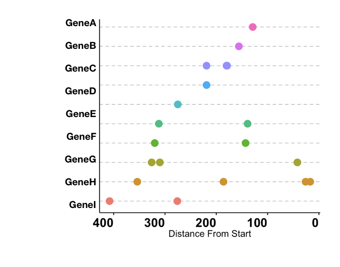
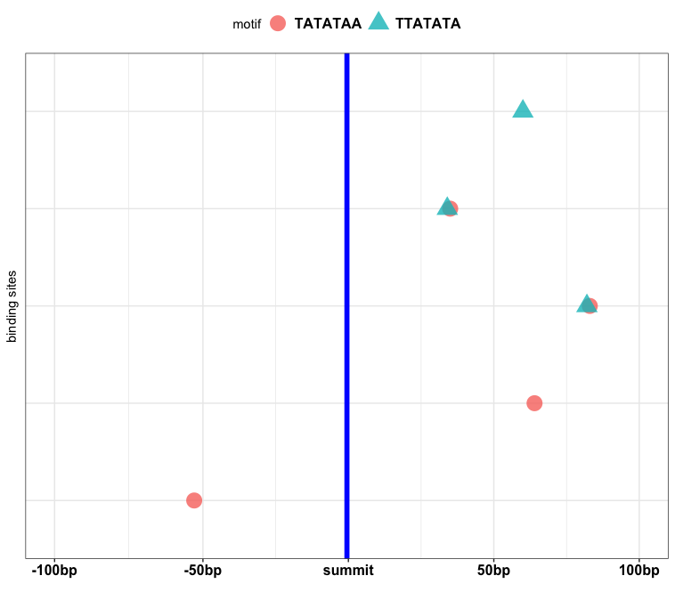

ChIPSeq data analysis and visualisation
================

motif\_location\_on\_sequence
-----------------------------

This function helps you to locate motifs on the reference fasta sequences provided by the user. As a prerequisite user have to provide the list of motifs and reference fasta sequence. User have to mention if he wants to display percentile location i.e. in case of ChIPSeq peaks when the binding site have variable lengths displaying percent position makes more sense. Or you can just plot the start of the motif on the sequence. This function takes into account the reverse complement of the motif while finding the motif so no need to worry about the motifs on complementary strands.

Input files

    1. fastaSequence file
    >GeneA
    GTGCAACGCGTATAAACCTTTGGGCCTCTCTCACGATGAATAGGGGCAGTAGCATTACACTCTGGCATAACAATAGGGCCCTGGCAATAGGGCTCTGGCAATAGGGCTCTGGCAATAGACTGTGGGAGGGCCATACTG
    >GeneB
    TAGAAGAAAAAAAGACAAGCAAAACAAAATCACACAACACATAATCAAAAAGCATTACACTCTGGCATAACAATAGGGCCCTGGCAATAGGGCTCTGGCAATAGGGCTCTGGCAATAGACTGTGGGAGGGCCATACTG

    2. mymotifs (can be copied from clipboard)
    TCAATAGGGGATT
    TGAATAGGGGC
    ACAATAGGGCC
    GCAATAGGGCT
    GCAATAGGGCT

Run the function as:

    motif_location_on_sequence(fastaSequence, mymotifs,"outfile",x = "start")

Output
------

1.  outfile\_GenesWithMotifs.txt
2.  Motif location visualisation 

## motif_distribution_from_summit 
This function helps to visualise motif distribution in the binding site of ChIP signal. 
As a a input provide list of motifs, genome fasta sequence, summits bedfile and flanking basepair from summits. 
Please mention which if the reverse complement of the given motifs is to be considered, works for DNA nucleotides only (A,T,G,C,N)

Input files
```
1. genome_fasta
>chrA
GTGCAACGCGTATAAACCTTTGGGCCTCTCTCACGATGAATAGGGGCAGTAGCATTACACTCTGGCATAACAATAGGGCCCTGGCAATAGGGCTCTGGCAATAGGGCTCTGGCAATAGACTGTGGGAGGGCCATACTG
>chrB
TAGAAGAAAAAAAGACAAGCAAAACAAAATCACACAACACATAATCAAAAAGCATTACACTCTGGCATAACAATAGGGCCCTGGCAATAGGGCTCTGGCAATAGGGCTCTGGCAATAGACTGTGGGAGGGCCATACTG

2. mymotifs (can be copied from clipboard)
TCAATAGGGGATT
TGAATAGGGGC
ACAATAGGGCC
GCAATAGGGCT
GCAATAGGGCT

3. macs2_summit_file
ChrA	222666	222667	A_narrow_peak_1	97.17213
ChrB	519643	519644	A_narrow_peak_2	12.13631
ChrA	619813	619814	A_narrow_peak_3	49.07928
ChrY	860772	860773	A_narrow_peak_4	24.225
ChrA	892756	892757	A_narrow_peak_5	219.14851
ChrB	897564	897565	A_narrow_peak_6	17.06805
ChrA	1281067	1281068	A_narrow_peak_7	212.36813
ChrY	1585030	1585031	A_narrow_peak_8	14.14571

4. flank_from_summit = 100

5. motif_revComplement="TRUE" (By default it is false)

```

Run the function as:
```
motif_distirbution_from_summits(macs2_summit_file,genome_fasta,mymotifs,flank_from_summit = 100, motif_revComplement="TRUE")
```
## Output
1. Motif distibution visualisation

